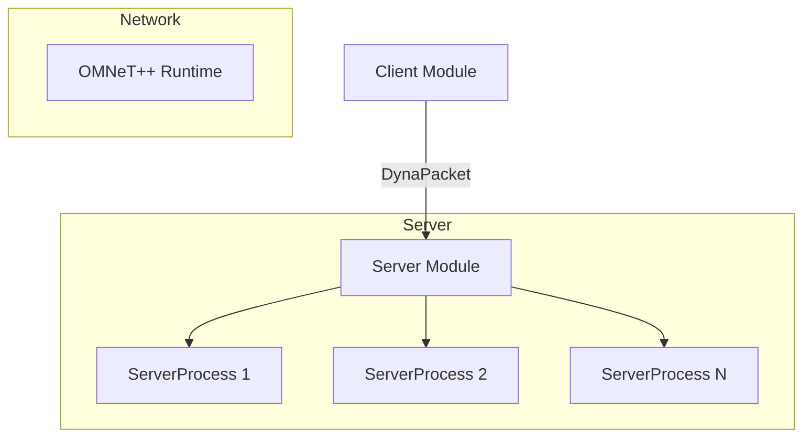

```mermaid
graph TD
    A[Client Module] -->|DynaPacket| B[Server Module]
    B --> C[ServerProcess 1]
    B --> D[ServerProcess 2]
    B --> E[ServerProcess N]
    
    subgraph Server
    B
    C
    D
    E
    end
    
    subgraph Network
    F[OMNeT++ Runtime]
    end
```