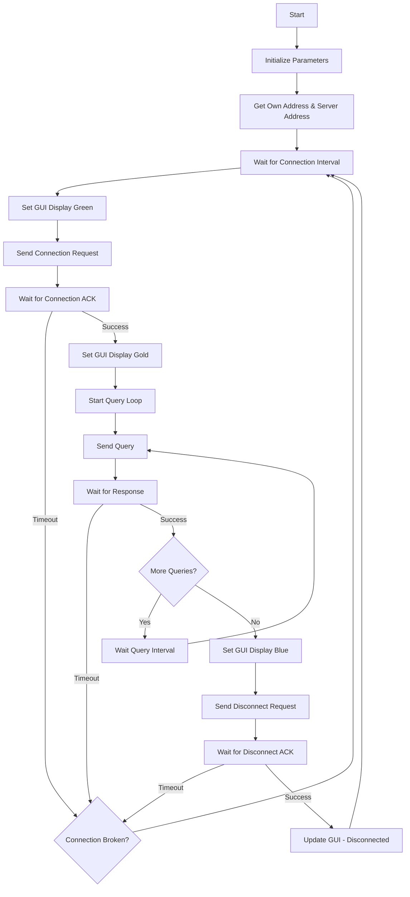

```mermaid
flowchart TD
    A[Start] --> B[Initialize Parameters]
    B --> C[Get Own Address & Server Address]
    C --> D[Wait for Connection Interval]
    D --> E[Set GUI Display Green]
    E --> F[Send Connection Request]
    F --> G[Wait for Connection ACK]
    
    G -->|Timeout| H{Connection Broken?}
    H --> D
    
    G -->|Success| I[Set GUI Display Gold]
    I --> J[Start Query Loop]
    
    J --> K[Send Query]
    K --> L[Wait for Response]
    
    L -->|Timeout| H
    L -->|Success| M{More Queries?}
    
    M -->|Yes| N[Wait Query Interval]
    N --> K
    
    M -->|No| O[Set GUI Display Blue]
    O --> P[Send Disconnect Request]
    P --> Q[Wait for Disconnect ACK]
    
    Q -->|Timeout| H
    Q -->|Success| R[Update GUI - Disconnected]
    R --> D
```