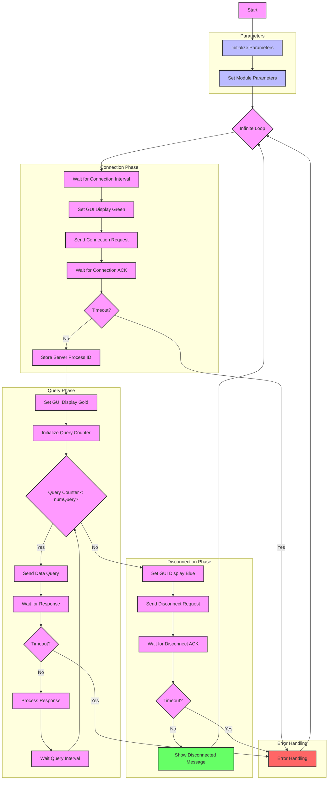

```mermaid
flowchart TD
    A[Start] --> B[Initialize Parameters]
    B --> C[Set Module Parameters]
    C --> D{Infinite Loop}
    
    D --> E[Wait for Connection Interval]
    E --> F[Set GUI Display Green]
    
    %% Connection Setup
    F --> G[Send Connection Request]
    G --> H[Wait for Connection ACK]
    H --> I{Timeout?}
    
    I -->|Yes| X[Error Handling]
    I -->|No| J[Store Server Process ID]
    
    %% Query Loop
    J --> K[Set GUI Display Gold]
    K --> L[Initialize Query Counter]
    L --> M{Query Counter < numQuery?}
    
    M -->|Yes| N[Send Data Query]
    N --> O[Wait for Response]
    O --> P{Timeout?}
    
    P -->|Yes| X
    P -->|No| Q[Process Response]
    Q --> R[Wait Query Interval]
    R --> M
    
    %% Disconnection
    M -->|No| S[Set GUI Display Blue]
    S --> T[Send Disconnect Request]
    T --> U[Wait for Disconnect ACK]
    U --> V{Timeout?}
    
    V -->|Yes| X
    V -->|No| W[Show Disconnected Message]
    
    %% Error and Continue
    W --> D
    X --> D
    
    %% Subgraphs
    subgraph Parameters
        B
        C
    end
    
    subgraph Connection Phase
        E
        F
        G
        H
        I
        J
    end
    
    subgraph Query Phase
        K
        L
        M
        N
        O
        P
        Q
        R
    end
    
    subgraph Disconnection Phase
        S
        T
        U
        V
        W
    end
    
    subgraph Error Handling
        X
    end
    
    %% Styling
    classDef default fill:#f9f,stroke:#333,stroke-width:2px
    classDef params fill:#bbf,stroke:#333,stroke-width:2px
    classDef error fill:#f66,stroke:#333,stroke-width:2px
    classDef success fill:#6f6,stroke:#333,stroke-width:2px
    
    class B,C params
    class X error
    class W success
```