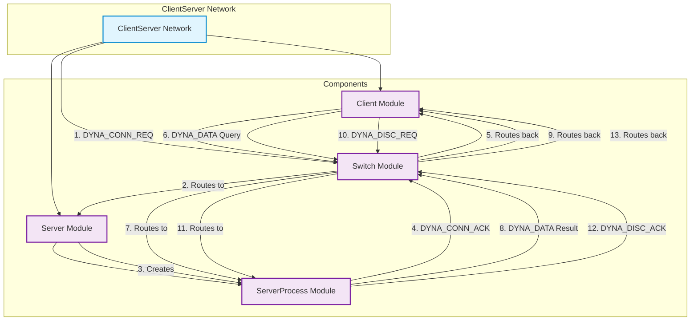

```mermaid
graph TD
    subgraph ClientServer Network
        CS[ClientServer Network]
    end

    subgraph Components
        CL[Client Module]
        SW[Switch Module]
        SV[Server Module]
        SP[ServerProcess Module]
    end

    %% Component Relationships
    CS --> CL
    CS --> SW
    CS --> SV
    SV --> SP

    %% Message Flow
    CL -->|1. DYNA_CONN_REQ| SW
    SW -->|2. Routes to| SV
    SV -->|3. Creates| SP
    SP -->|4. DYNA_CONN_ACK| SW
    SW -->|5. Routes back| CL
    
    %% Data Exchange
    CL -->|6. DYNA_DATA Query| SW
    SW -->|7. Routes to| SP
    SP -->|8. DYNA_DATA Result| SW
    SW -->|9. Routes back| CL
    
    %% Disconnection
    CL -->|10. DYNA_DISC_REQ| SW
    SW -->|11. Routes to| SP
    SP -->|12. DYNA_DISC_ACK| SW
    SW -->|13. Routes back| CL

    classDef default fill:#f9f9f9,stroke:#333,stroke-width:2px;
    classDef network fill:#e1f5fe,stroke:#0288d1,stroke-width:2px;
    classDef component fill:#f3e5f5,stroke:#7b1fa2,stroke-width:2px;
    classDef message fill:#fff3e0,stroke:#ef6c00,stroke-width:2px;

    class CS network;
    class CL,SW,SV,SP component;
    class CR,CA,DQ,DR,DA message;
```