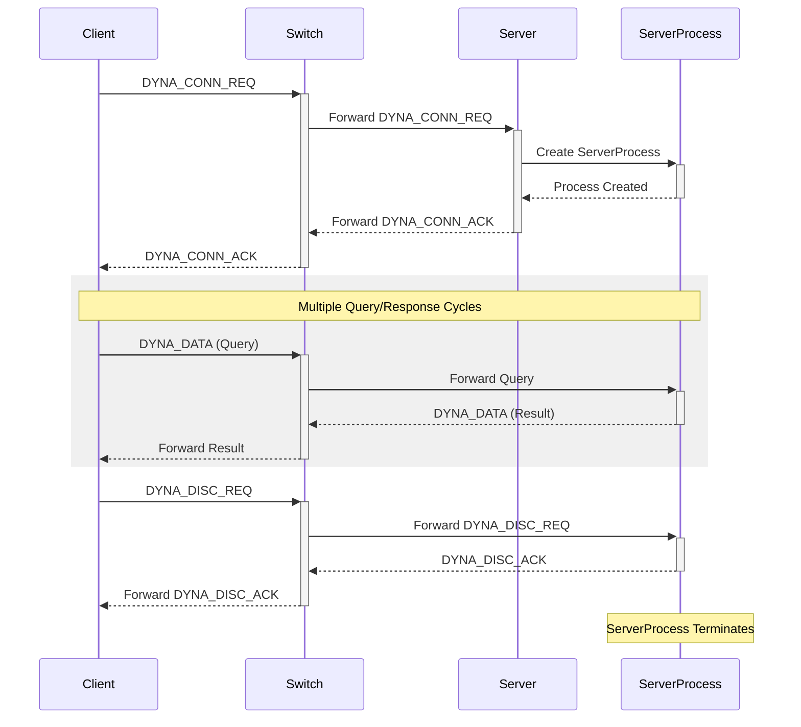

```mermaid
sequenceDiagram
    participant C as Client
    participant SW as Switch
    participant S as Server
    participant SP as ServerProcess

    %% Connection Establishment
    C->>+SW: DYNA_CONN_REQ
    SW->>+S: Forward DYNA_CONN_REQ
    S->>+SP: Create ServerProcess
    SP-->>-S: Process Created
    S-->>-SW: Forward DYNA_CONN_ACK
    SW-->>-C: DYNA_CONN_ACK

    %% Data Exchange Loop
    rect rgb(240, 240, 240)
        Note over C,SP: Multiple Query/Response Cycles
        C->>+SW: DYNA_DATA (Query)
        SW->>+SP: Forward Query
        SP-->>-SW: DYNA_DATA (Result)
        SW-->>-C: Forward Result
    end

    %% Connection Teardown
    C->>+SW: DYNA_DISC_REQ
    SW->>+SP: Forward DYNA_DISC_REQ
    SP-->>-SW: DYNA_DISC_ACK
    SW-->>-C: Forward DYNA_DISC_ACK
    Note over SP: ServerProcess Terminates
```