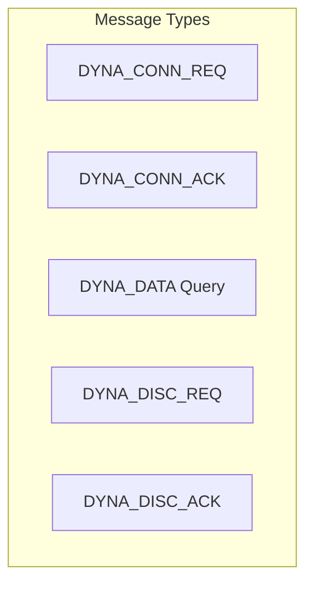

```mermaid
graph TD
    subgraph Message Types
        CR[DYNA_CONN_REQ]
        CA[DYNA_CONN_ACK]
        DQ[DYNA_DATA Query]
        DR[DYNA_DATA Result]
        DR[DYNA_DISC_REQ]
        DA[DYNA_DISC_ACK]
    end

```