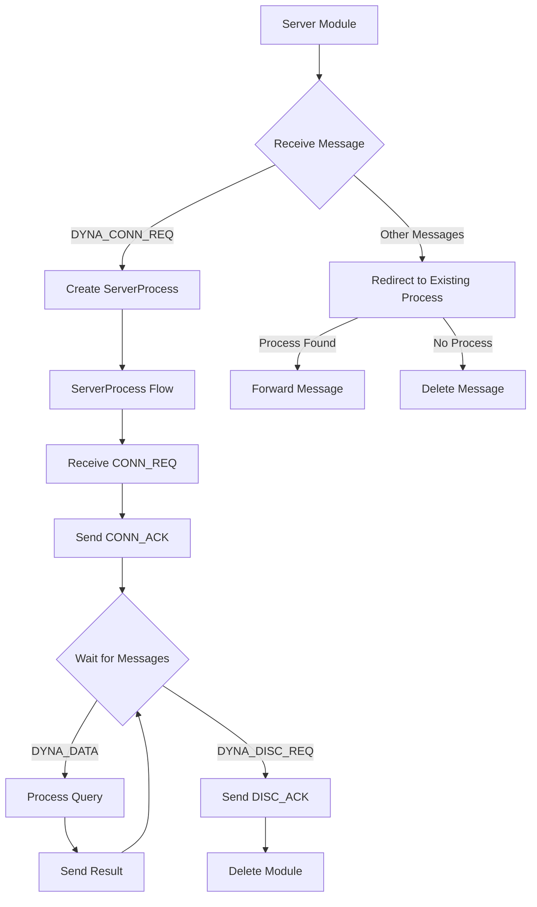

```mermaid
flowchart TD
    A[Server Module] --> B{Receive Message}
    B -->|DYNA_CONN_REQ| C[Create ServerProcess]
    B -->|Other Messages| D[Redirect to Existing Process]
    
    C --> E[ServerProcess Flow]
    
    E --> F[Receive CONN_REQ]
    F --> G[Send CONN_ACK]
    G --> H{Wait for Messages}
    
    H -->|DYNA_DATA| I[Process Query]
    I --> J[Send Result]
    J --> H
    
    H -->|DYNA_DISC_REQ| K[Send DISC_ACK]
    K --> L[Delete Module]
    
    D -->|Process Found| M[Forward Message]
    D -->|No Process| N[Delete Message]
```